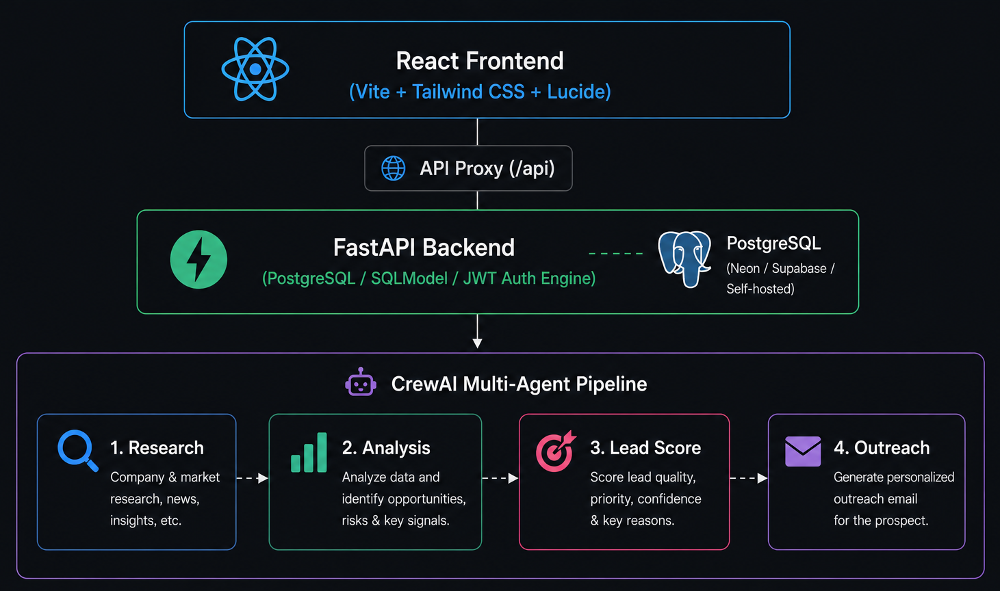

# SDR Agent — AI-Powered Sales Prospecting & Outreach Pipeline

**SDR Agent** is an autonomous B2B sales intelligence platform that automates prospect research, strategic opportunity analysis, lead scoring, and personalized outreach generation using a multi-agent AI crew.

---

## 🌟 Key Features

- 🔍 **Company Research Agent**: Scrapes and synthesizes company background, funding history, core tech stack, leadership team, and recent news.
- 📊 **Strategic Analysis Agent**: Evaluates sales opportunities, identifies pain points, assesses market positioning, and formulates go-to-market sales angles.
- 🎯 **Automated Lead Scoring**: Evaluates prospect alignment on a 0–100 scale with deterministic priority ratings (`High` / `Medium` / `Low`), confidence metrics, and structured fit reasons.
- ✉️ **Personalized Outreach Generation**: Drafts tailored cold email sequences targeting key decision-makers based on strategic research insights.
- 💎 **Modern Glassmorphism UI**: High-craft dark mode React dashboard featuring real-time visual pipeline progress, synchronized step nodes, and markdown rendering.
- 📜 **Generation History & Search**: Full search and history page to review past prospect intelligence and outreach emails.

---

## 🏗️ System Architecture



---

## 🛠️ Technology Stack

### Frontend (`/client`)
- **Core**: React 19, TypeScript, Vite
- **Styling**: Tailwind CSS v4, Vanilla CSS Design System with Liquid Glassmorphism
- **Icons**: Lucide React
- **Markdown**: `react-markdown`, `remark-gfm`

### Backend (`/server`)
- **Framework**: FastAPI (Python)
- **Database & ORM**: SQLModel (SQLAlchemy + Pydantic) / SQLite / PostgreSQL
- **Multi-Agent Orchestration**: CrewAI framework
- **Search & Tools**: Tavily Web Search API
- **Auth**: Passlib (Bcrypt password hashing), PyJWT (Bearer Tokens)

---

## 🚀 Getting Started

### Prerequisites
- **Python**: `3.10` or higher
- **Node.js**: `18.0.0` or higher
- **API Keys**: LLM Provider key (Groq, Cerebras, or OpenAI) and Tavily API Key

---

### 1. Backend Setup

1. Navigate to the `server` directory:
   ```bash
   cd server
   ```

2. Create and activate a Python virtual environment:
   - **Linux / macOS**:
     ```bash
     python -m venv venv
     source venv/bin/activate
     ```
   - **Windows**:
     ```cmd
     python -m venv venv
     venv\Scripts\activate
     ```

3. Install backend dependencies:
   ```bash
   pip install -r requirements.txt
   ```

4. Configure environment variables in `.env`:
   ```env
   SECRET_KEY=your_jwt_secret_key_here
   DATABASE_URL=sqlite:///./sdr_agent.db
   GROQ_API_KEY=your_groq_api_key
   TAVILY_API_KEY=your_tavily_api_key
   ```

5. Start the FastAPI development server:
   ```bash
   uvicorn main:app --reload --port 8000
   ```

The backend server will run on `http://127.0.0.1:8000`.

---

### 2. Frontend Setup

1. Open a new terminal and navigate to the `client` directory:
   ```bash
   cd client
   ```

2. Install Node.js dependencies:
   ```bash
   npm install
   ```

3. Start the Vite development server:
   ```bash
   npm run dev
   ```

The application will be available at `http://localhost:3000`.

---

## 📁 Project Structure

```
SDR_Agent/
├── client/                      # React TypeScript Frontend
│   ├── src/
│   │   ├── components/          # Reusable UI Components
│   │   │   ├── generations/     # StageContentPanel, RightPipelineCards, etc.
│   │   │   └── MarkdownRenderer.tsx
│   │   ├── pages/               # Dashboard, Generations, HistoryPage, Auth
│   │   ├── services/            # API client (auth, generations, pipeline)
│   │   ├── types/               # TypeScript interfaces
│   │   ├── App.tsx              # Main layout & routing
│   │   └── index.css            # Global CSS & Glassmorphism design tokens
│   ├── package.json
│   └── vite.config.ts           # Vite proxy mapping /api to http://localhost:8000
│
└── server/                      # FastAPI Python Backend
    ├── api/                     # REST Endpoints (auth.py, generate.py)
    ├── agents/                  # CrewAI Agent definitions
    ├── tasks/                   # CrewAI Task definitions
    ├── crew/                    # Sequential Crew orchestration pipeline
    ├── db/                      # Database engine & SQLModel entities
    ├── main.py                  # FastAPI application entrypoint
    └── requirements.txt
```

---

## 📄 API Endpoints Summary

| Method | Endpoint | Description |
| :--- | :--- | :--- |
| `POST` | `/api/auth/register` | Create a new user account |
| `POST` | `/api/auth/login` | Authenticate user and return JWT bearer token |
| `GET` | `/api/auth/me` | Fetch current logged-in user profile |
| `POST` | `/api/generate/` | Run multi-agent pipeline for a company prospect |
| `GET` | `/api/generate/` | List all historical prospect generations for current user |
| `GET` | `/api/generate/{id}` | Fetch detailed generation result by ID |

---

## 📜 License

This project is open-source under the [MIT License](LICENSE).
